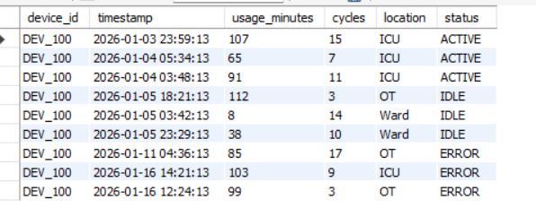
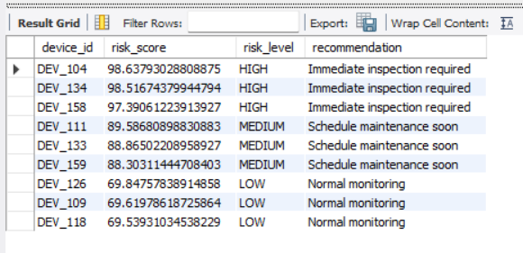

# Medical Device Usage Risk Detection System

## Problem Statement

Healthcare facilities rely on multiple medical devices across departments (ICU, OT, wards). However:

* Device usage patterns are **not monitored effectively**
* Sudden spikes, inconsistent usage, or excessive movement often go unnoticed
* Maintenance decisions are **reactive instead of proactive**
* Lack of visibility leads to **operational risks and potential device failures**

👉 The challenge was to build a system that can **identify high-risk devices early using usage data**.

---

## 💡 Solution Approach

I designed an **end-to-end analytics pipeline** that ingests device logs from a database and computes a unified risk score per device.

---

### Step 1: Data Ingestion

* Connected to **MySQL database (`device_logs` table)*
### Source Data (MySQL - device_logs)

The system ingests raw device logs from the `device_logs` table in MySQL.  
This data captures device-level operational activity across time.

**Key fields include:**
- `device_id` → Unique identifier for each device  
- `timestamp` → Event timestamp  
- `usage_minutes` → Duration of device usage  
- `cycles` → Number of operational cycles  
- `location` → Device location (ICU, Ward, OT)  
- `status` → Operational state (ACTIVE, IDLE, ERROR)  

<p align="center">
  
</p>

*Sample records showing diverse device states and usage patterns.*

---

### Step 2: Feature Engineering

Three key behavioral indicators were derived:

#### 1. Usage Variability

* Measures inconsistency in daily usage
* High variability = unstable usage pattern

#### 2. Intensity Score

* Based on total usage minutes and operational cycles
* Normalized across devices for fair comparison

#### 3. Movement Behavior

* Tracks location changes over time
* Frequent movement indicates operational stress or mismanagement

---

### Step 3: Risk Scoring Model

A weighted scoring system was implemented:

* Usage Variability → 40%
* Intensity Score → 40%
* Movement Count → 20%

👉 This creates a **single unified risk score per device**

---

### Step 4: Risk Classification

Devices are categorized into:

* **HIGH Risk** → Immediate inspection required
* **MEDIUM Risk** → Schedule maintenance soon
* **LOW Risk** → Normal monitoring

---

### Step 5: Output Storage (MySQL Integration)

* Final results are **persisted back into MySQL**
* Stored in a dedicated table (e.g., `device_risk_scores`)
* Enables:

  * Centralized storage of risk insights
  * Easy querying for dashboards or reporting
  * Integration with downstream systems

---

## System Architecture

```text
MySQL (device_logs)
        ↓
ingestion/loader.py
        ↓
analytics modules
        ↓
run_pipeline.py
        ↓
MySQL (device_risk_scores)
```

---

### Output (MySQL - device_risk_scores)

The pipeline processes device logs and stores computed risk insights in the `device_risk_scores` table in MySQL.

**Output includes:**
- `device_id` → Device identifier  
- `risk_score` → Computed weighted risk score  
- `risk_level` → Classification (HIGH / MEDIUM / LOW)  
- `recommendation` → Suggested action based on risk  

<p align="center">
  
</p>

*Sample output showing categorized device risk levels and recommended actions.*

## Tech Stack

* Python (Pandas, NumPy)
* MySQL (Data source + output storage)
* SQL (Data querying)
* Git & GitHub

---

## Key Outcomes

* Transformed raw device logs into **actionable insights**
* Enabled **early detection of high-risk devices**
* Stored results in **MySQL for centralized access and scalability**
* Built a **modular and production-ready pipeline architecture**

---

## Future Improvements

* Real-time streaming data integration
* Dashboard (Power BI / Streamlit)
* Predictive ML-based risk modeling
* REST API for external system integration

---

## Author

Sheetal Shahane
